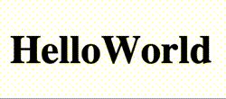

# Wave Text Animation



>npm i wave-text-animation

>import package

```js
import waveTextAnimation from 'wave-text-animation';
```

>calling waveTextAnimation function from a package with id container and text to animate

```js
waveTextAnimation('text', 'hello world');
````

>Add this container in html - div or p or whatever you want but with<mark> id="text" class="text"</mark> 

```html
<div id="text" class="text"></div
```

>Place this CSS in a file

```css
.text {
  position: relative;
  margin: 0; padding: 0;
}
.pTwo {
  margin: 0;
  position: absolute;
  top: 0; left: 0;
  width: 100%;
}
.pOne span {
  transform-origin: bottom;
}
.pTwo span {
  transform-origin: top;
  color: transparent;
  transform: translateY(100%) rotateX(-90deg);
}
.text:hover .pOne span {
  color: transparent;
  transform: translateY(-100%) rotateX(-90deg);
}
.text:hover .pTwo span {
  color: #000;
  transform: translateY(0%) rotateX(0deg);
}
```